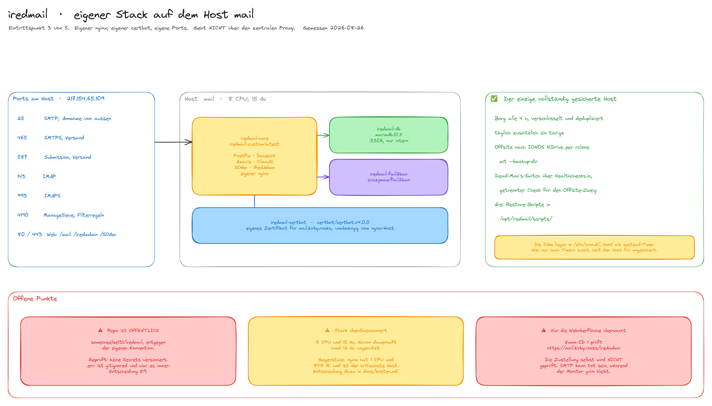

# iRedMail Docker

A production-ready, dockerized iRedMail mail server with all components included in a single, easy-to-deploy solution.



> **Einordnung in die Infrastruktur, gemessen am 2026-08-26**
>
> | | |
> |---|---|
> | **Zielhost** | `mail` (217.154.65.109), 8 CPU, 15 Gi |
> | **Pfad** | `/opt/iredmail` |
> | **Container** | `iredmail-core`, `iredmail-db` (mariadb:10.11), `iredmail-fail2ban`, `iredmail-certbot` (certbot/certbot:v4.0.0) |
> | **Ports** | 25, 143, 465, 587, 993, 4190, dazu 80 und 443 für `/mail`, `/iredadmin`, `/SOGo` |
> | **Eintrittspunkt** | **eigener Stack.** Geht **nicht** über den zentralen nginx, `mail.kirby.rocks` steht **nicht** in `nginx/domains.conf`, das Zertifikat holt der stackeigene certbot |
> | **Git** | `someoneelse131/iredmail`, ⚠️ **öffentlich**, entgegen der Konvention. Geprüft: keine Secrets versioniert, `.env` war immer gitignored. Entscheidung E9 |
> | **Kuma** | ID 1, prüft `https://mail.kirby.rocks/iredadmin`. ⚠️ **Nur die Weboberfläche.** Die Zustellung selbst wird nicht geprüft |
>
> ### ✅ Der einzige vollständig gesicherte Host
>
> - **Borg alle 4 h**, verschlüsselt und dedupliziert (`15 */4 * * *`)
> - **täglich ein tar.gz** (`0 2 * * *`)
> - **Offsite nach IONOS HiDrive** per `rclone sync` auf
>   `hidrive:/backup/iredmail/data`, mit `--backup-dir` in ein Verzeichnis
>   `.trash/<Zeitstempel>` statt zu löschen
> - **Dead-Man's-Switch über Healthchecks.io**, mit **getrenntem** Check für den
>   Offsite-Zweig, damit ein stiller HiDrive-Ausfall unabhängig alarmiert
> - drei Restore-Skripte: `restore.sh`, `restore-borg.sh`, `restore-mailbox.sh`
>
> ⚠️ **Die Jobs liegen in `/etc/cron.d/`, nicht als systemd-Timer.** Wer nur
> nach Timern sucht, hält diesen Host für ungesichert. Genau dieser Irrtum
> stand bis 2026-08-23 in der Infrastruktur-Dokumentation.
>
> ### ⚠️ Ein zweiter, abgeschalteter Offsite-Weg, und warum er scheiterte
>
> `/etc/cron.d/iredmail-offsite-backup**.disabled**`.
> Cron ignoriert jeden Dateinamen mit einem Punkt darin, der Job läuft also
> nicht. Er rief `offsite-backup.sh` auf, das per `scp` zur **Synology**
> (`10.0.0.2:44` durch den WireGuard-Tunnel) sicherte. Letzter Lauf am
> **28.04.2026**, gescheitert mit `Cannot reach 10.0.0.2 – VPN down?`.
>
> Dass der Job abgeschaltet ist, war bekannt. **Neu ist am 2026-08-26 die
> Ursache:** er sicherte per `scp` zur Synology durch den WireGuard-Tunnel, und
> der hat für `mail` nie getragen. Der Peer steht nur in der Repo-Vorlage, nicht
> in der Datei, die der Container liest, und Port 44 ist am Container nie
> veröffentlicht worden. Zwei unabhängige Blocker.
>
> **Kein Verlust:** `rclone.conf` ist vom 01.05.2026, drei Tage nach dem letzten
> Fehlschlag. HiDrive hat den Weg abgelöst. **Der Ertrag ist ein anderer:** der
> Tunnel existierte für genau dieses Backup, also hat er für `mail` keinen Zweck
> mehr. Damit ist die offene Frage „toten Peer reparieren oder abbauen"
> beantwortbar geworden. Siehe `../wireguard/README.md` Abschnitt 2 und
> `../docs/backup-konzept.md` Abschnitt 1.1.

This project addresses known issues with the archived official iRedMail Docker image and provides a stable, maintainable alternative.

## Features

- **Full Mail Stack**: Postfix (MTA), Dovecot (IMAP/POP3), Amavisd, ClamAV, SpamAssassin
- **Webmail**: Roundcube webmail client
- **Groupware**: SOGo with Calendar, Contacts, and ActiveSync support
- **Admin Panel**: iRedAdmin for user and domain management
- **Policy Server**: iRedAPD for greylisting, throttling, and access control
- **Security**: Fail2ban intrusion prevention (6 jails incl. recidive), DKIM, SPF, DMARC, hardened Postfix (TLSv1.2+, mandatory STARTTLS for AUTH, FQDN sender/recipient checks)
- **SSL/TLS**: Let's Encrypt integration with automatic renewal
- **Multi-Domain**: Support for unlimited mail domains
- **Process Management**: s6-overlay for reliable service supervision
- **Spam learning**: User-trained Bayes via IMAP move triggers — drag to/from Junk in any client (Roundcube, Thunderbird, mobile) → Dovecot `imap_sieve` → `sa-learn` (no server-side button needed)
- **Backups**: Borg (4-hour cadence, deduplicating, encrypted with `repokey-blake2`) + HiDrive WebDAV offsite mirror with versioned trash for ransomware-resistance + two independent Healthchecks.io dead-man's switches

## Architecture

### Container Layout

| Container | Components | Purpose |
|-----------|------------|---------|
| `iredmail-core` | Postfix, Dovecot, Amavisd, ClamAV, SpamAssassin, iRedAPD, Nginx, PHP-FPM, Roundcube, iRedAdmin, SOGo | All mail + web services |
| `iredmail-db` | MariaDB 10.11 | Database (separate for safety/backups) |
| `iredmail-fail2ban` | Fail2ban | Intrusion prevention (host network) |
| `iredmail-certbot` | Certbot | SSL auto-renewal |

### Why This Design?

**Hybrid approach instead of microservices:**
- Mail components (Postfix/Dovecot/Amavisd) are tightly coupled via sockets and queues
- Reduces complexity without sacrificing reliability
- Database separation allows independent backups and scaling
- Single container simplifies deployment while maintaining all functionality

## Known Issues Fixed

This project fixes all known issues from the archived official iRedMail Docker image:

| Issue | Problem | Solution |
|-------|---------|----------|
| Archived/unstable | Official image no longer maintained | Built custom image from scratch with Ubuntu 22.04 |
| Custom config ignored | Configuration changes not applied | Enhanced init with explicit custom config loading |
| SASL auth fails | SMTP authentication broken | Installed libsasl2-modules, configured Dovecot auth socket |
| Fail2ban/iptables | Cannot access host iptables | Separate container on host network with NET_ADMIN |
| Passwords reset | Credentials reset on container restart | Fixed passwords via .env with persistence check |
| Services not starting | Services fail to auto-start | s6-overlay init system with proper dependencies |
| MariaDB settings ignored | Database config not applied | Separate container with proper file permissions |
| Cloudflare/proxy issues | Real IP not detected behind proxy | Nginx real_ip configuration included |

## Requirements

- Docker Engine 20.10+
- Docker Compose v2+
- 4GB RAM minimum (8GB recommended for ClamAV)
- 20GB disk space minimum
- Valid domain with DNS control
- Clean IP address (not on blacklists)
- Ports 25, 80, 443, 465, 587, 993, 4190 accessible

## Quick Start

### 1. Clone and Setup

```bash
git clone https://github.com/yourusername/iredmail-docker.git
cd iredmail-docker
./setup.sh
```

The setup script creates necessary directories, copies the example environment file, and optionally configures UFW firewall rules.

### 2. Configure Environment

Edit `.env` file with your settings:

```bash
nano .env
```

**Required settings:**

| Variable | Description | Example |
|----------|-------------|---------|
| `HOSTNAME` | Mail server FQDN | `mail.example.com` |
| `FIRST_MAIL_DOMAIN` | Primary mail domain | `example.com` |
| `FIRST_MAIL_DOMAIN_ADMIN_PASSWORD` | Postmaster password | `SecurePassword123!` |
| `MYSQL_ROOT_PASSWORD` | Database root password | `RandomSecureString` |
| `LETSENCRYPT_EMAIL` | SSL notification email | `admin@example.com` |

**Optional but recommended (backup alerting):**

| Variable | Description |
|----------|-------------|
| `BORG_PASSPHRASE` | Generated by `setup.sh` (64 hex chars). Required for backup. Also store separately (1Password + paper). |
| `HEALTHCHECKS_URL` | Healthchecks.io ping URL for the local 4h Borg backup. `/start`, success, and `/fail` get pinged. |
| `HEALTHCHECKS_OFFSITE_URL` | Separate ping URL for the HiDrive offsite mirror, so a silent remote outage alerts independently. |

> **Security Note**: Generate strong, unique passwords for all database credentials. The `BORG_PASSPHRASE` is the single point of failure for restore — losing it means the encrypted repo is unrecoverable.

### 3. Configure DNS

Before starting, configure these DNS records for your domain:

#### Required Records

| Type | Name | Value |
|------|------|-------|
| A | `mail.example.com` | `YOUR_SERVER_IP` |
| MX | `example.com` | `10 mail.example.com` |
| TXT | `example.com` | `v=spf1 mx -all` |
| TXT | `_dmarc.example.com` | `v=DMARC1; p=quarantine; rua=mailto:postmaster@example.com` |
| PTR | `YOUR_SERVER_IP` | `mail.example.com` (configure with hosting provider) |

#### DKIM Record (add after first start)

```
dkim._domainkey.example.com.  IN  TXT  "v=DKIM1; k=rsa; p=YOUR_PUBLIC_KEY"
```

### 4. Build and Start

```bash
# Build the image
docker compose build

# Start services
docker compose up -d

# Watch startup logs (Ctrl+C to exit)
docker compose logs -f
```

First startup takes 3-5 minutes while ClamAV downloads virus definitions.

### 5. Obtain SSL Certificate

After DNS is configured and propagated:

```bash
./scripts/obtain-cert.sh
```

The script will:
- Detect if a valid Let's Encrypt certificate exists
- Obtain a new certificate if needed (or if only self-signed exists)
- Automatically reload all services
- Skip renewal if certificate is valid for more than 30 days

> **Note**: Certificate auto-renewal runs every 12 hours via the certbot container.

### 6. Access Your Mail Server

| Service | URL | Default Login |
|---------|-----|---------------|
| **Webmail** | `https://mail.example.com/mail/` | `postmaster@example.com` |
| **Admin Panel** | `https://mail.example.com/iredadmin/` | `postmaster@example.com` |
| **SOGo** | `https://mail.example.com/SOGo/` | `postmaster@example.com` |

## Project Structure

```
iredmail-docker/
├── docker-compose.yml          # Container orchestration
├── Dockerfile                  # Main image build
├── .env.example                # Environment template
├── setup.sh                    # Initial setup script
├── rootfs/
│   └── etc/
│       └── s6-overlay/
│           ├── s6-rc.d/        # Service definitions
│           │   ├── postfix/
│           │   ├── dovecot/
│           │   ├── amavisd/
│           │   ├── clamav/
│           │   ├── nginx/
│           │   ├── php-fpm/
│           │   ├── sogo/
│           │   ├── iredapd/
│           │   ├── iredadmin/
│           │   └── cert-reload/
│           └── scripts/
│               └── init.sh     # Initialization script
├── config/                     # Custom configuration overrides
│   ├── postfix/
│   ├── dovecot/
│   ├── amavis/
│   ├── mariadb/
│   ├── nginx/
│   ├── iredadmin/
│   ├── roundcube/
│   ├── sogo/
│   └── fail2ban/
├── scripts/
│   ├── obtain-cert.sh          # SSL certificate management
│   ├── add-domain.sh           # Add mail domains
│   ├── setup-firewall.sh       # UFW firewall configuration
│   ├── borg-backup.sh          # Borg-based backup (4h, primary)
│   ├── borg-backup-cron        # Cron job for borg-backup.sh
│   ├── restore-borg.sh         # Interactive Borg restore
│   ├── backup.sh               # Legacy daily tar backup
│   ├── backup-cron             # Legacy backup cron + expunge cleanup
│   ├── offsite-backup.sh       # Legacy offsite scp (currently disabled)
│   ├── offsite-backup-cron     # Cron file for legacy offsite
│   ├── restore.sh              # Legacy tar-based restore
│   └── restore-mailbox.sh      # Restore a single mailbox from tar backup
├── sql/                        # Database schemas
│   ├── vmail.sql
│   ├── iredadmin.sql
│   ├── iredapd.sql
│   ├── amavisd.sql
│   ├── roundcubemail.sql
│   └── sogo.sql
└── data/                       # Runtime data (gitignored)
    ├── mysql/
    ├── vmail/
    ├── dkim/
    ├── ssl/
    ├── clamav/
    ├── sogo/
    ├── logs/
    ├── borg-repo/               # Borg backup repository (encrypted)
    ├── db-dumps/                # Latest mysqldump (regenerated each Borg run)
    └── backup/                  # Legacy tar.gz backups
```

## DKIM Setup

After first start, retrieve your DKIM public key:

```bash
docker exec iredmail-core amavisd-new showkeys
```

Or extract just the key:

```bash
docker exec iredmail-core cat /var/lib/dkim/example.com.pem | \
    openssl rsa -pubout 2>/dev/null | \
    grep -v '^-' | tr -d '\n'
```

Add the DKIM DNS record with the output.

## Adding Domains

```bash
./scripts/add-domain.sh newdomain.com
```

This will:
1. Add the domain to the database
2. Generate DKIM keys
3. Display required DNS records for the new domain

## Email Client Configuration

### IMAP (Recommended)

| Setting | Value |
|---------|-------|
| Server | `mail.example.com` |
| Port | `993` |
| Security | SSL/TLS |
| Username | Full email address |

### SMTP (Outgoing)

| Setting | Value |
|---------|-------|
| Server | `mail.example.com` |
| Port | `587` (STARTTLS) or `465` (SSL/TLS) |
| Security | STARTTLS or SSL/TLS |
| Username | Full email address |

### ActiveSync (Mobile)

| Setting | Value |
|---------|-------|
| Server | `mail.example.com` |
| Domain | (leave empty) |
| Username | Full email address |

### CalDAV/CardDAV

| Service | URL |
|---------|-----|
| Calendar | `https://mail.example.com/SOGo/dav/USERNAME/Calendar/personal/` |
| Contacts | `https://mail.example.com/SOGo/dav/USERNAME/Contacts/personal/` |

## Email Autodiscovery

This mail server supports automatic client configuration via industry-standard autodiscovery protocols. When users add their email account, clients like Thunderbird, Outlook, iOS Mail, and Android automatically detect the correct server settings.

### Supported Protocols

| Protocol | Used By | Endpoint |
|----------|---------|----------|
| Mozilla Autoconfig | Thunderbird, iOS, Android, many others | `/.well-known/autoconfig/mail/config-v1.1.xml` |
| Microsoft Autodiscover | Outlook, Windows Mail | `/autodiscover/autodiscover.xml` |
| DNS SRV Records | iOS, macOS Mail, others | `_imap._tcp`, `_submission._tcp` |

### How It Works

1. User enters email `user@example.com` in their mail client
2. Client queries `autoconfig.example.com` or `example.com/.well-known/autoconfig/...`
3. Server returns XML with IMAP/SMTP settings
4. Client auto-configures - no manual server entry needed

### Required DNS Records for Autodiscovery

For each mail domain, add these records to enable autodiscovery:

```
# Point autodiscovery hostnames to your mail server
autoconfig.example.com.        IN CNAME  mail.example.com.
autodiscover.example.com.      IN CNAME  mail.example.com.

# SRV records for RFC 6186 compliant clients
_imap._tcp.example.com.        IN SRV    0 1 993 mail.example.com.
_imaps._tcp.example.com.       IN SRV    0 1 993 mail.example.com.
_submission._tcp.example.com.  IN SRV    0 1 587 mail.example.com.
```

### Testing Autodiscovery

```bash
# Test Mozilla Autoconfig
curl -s "https://mail.example.com/.well-known/autoconfig/mail/config-v1.1.xml?emailaddress=test@example.com"

# Test Microsoft Autodiscover
curl -s -X POST \
  -H "Content-Type: application/xml" \
  -d '<?xml version="1.0"?><Autodiscover xmlns="http://schemas.microsoft.com/exchange/autodiscover/outlook/requestschema/2006"><Request><EMailAddress>test@example.com</EMailAddress></Request></Autodiscover>' \
  "https://mail.example.com/autodiscover/autodiscover.xml"
```

### Client Compatibility

| Client | Protocol | Auto-Detection |
|--------|----------|----------------|
| Thunderbird | Mozilla Autoconfig | Full |
| Apple Mail (iOS/macOS) | Autoconfig + SRV | Full |
| Android Mail (Gmail app) | Mozilla Autoconfig | Full |
| Outlook (Desktop) | Microsoft Autodiscover | Full |
| Outlook (Mobile) | Microsoft Autodiscover | Full |
| Windows Mail | Microsoft Autodiscover | Full |
| K-9 Mail | Mozilla Autoconfig | Full |

## Ports

| Port | Service | Protocol | Notes |
|------|---------|----------|-------|
| 25 | SMTP | TCP | Incoming mail |
| 465 | SMTPS | TCP | Secure SMTP submission |
| 587 | Submission | TCP | STARTTLS submission |
| 143 | IMAP | TCP | Unencrypted (redirects to TLS) |
| 993 | IMAPS | TCP | Secure IMAP |
| 80 | HTTP | TCP | Let's Encrypt challenges |
| 443 | HTTPS | TCP | Web interfaces |
| 4190 | ManageSieve | TCP | Sieve filter management |

> **Note**: POP3 ports (110, 995) are disabled by default. Enable in `docker-compose.yml` if needed.

## Data Persistence

All data is stored in the `./data/` directory:

| Directory | Contents |
|-----------|----------|
| `data/mysql/` | Database files |
| `data/vmail/` | Email storage |
| `data/dkim/` | DKIM keys |
| `data/ssl/` | SSL certificates |
| `data/clamav/` | Virus definitions |
| `data/sogo/` | SOGo cache |
| `data/logs/` | Service logs (shared with fail2ban) |

## Backup & Restore

Two backup systems run in parallel:

| | Borg (primary) | Tar (legacy / safety net) |
|---|---|---|
| Frequency | every 4 h (00:15, 04:15, …, 20:15) | daily 02:00 |
| Format | deduplicating, encrypted (BLAKE2b) | gzipped tar |
| Storage | `data/borg-repo/` | `data/backup/iredmail_backup_*.tar.gz` |
| Retention | 6 hourly + 14 daily + 8 weekly + 12 monthly | 30 days |
| Restore tool | `scripts/restore-borg.sh` | `scripts/restore.sh` |

The Borg path is what you should use for both routine restores and disaster recovery. The tar path is kept for now as a second, independent safety net.

### Borg backup (primary)

`setup.sh` installs `borgbackup`, generates a `BORG_PASSPHRASE` (64 hex chars) into `.env`, runs `borg init --encryption=repokey-blake2`, and installs the 4-hour cron at `/etc/cron.d/iredmail-borg-backup`.

Logs go to `data/logs/borg-backup.log`.

The script (`scripts/borg-backup.sh`) does, on each run:

1. `mysqldump --all-databases --single-transaction` → `data/db-dumps/all_databases.sql`
2. `borg create` over `data/`, `config/`, `rootfs/`, `scripts/`, `docker-compose.yml`, `Dockerfile`, `.env` — with these `data/` subdirectories excluded: `backup/` (legacy tar), `borg-repo/` (would recurse), `logs/`, `mysql/` (raw DB files; we use the dump), `clamav/`, `postfix-queue/`, `certbot-www/`, `rescue-*/`, `amavis-spamassassin/` (Bayes hashdbs are constantly rewritten and not crash-consistent to copy live; state is regenerable by re-training).
3. `borg prune` per retention policy
4. `borg compact` once a week (Sundays at 00:xx)

Borg returns `rc=1` for non-fatal warnings (e.g. a file changed while being read — the archive is still valid). The script wraps `borg create/prune/compact` in a `run_borg()` helper that treats `rc=0` and `rc=1` as success and only escalates `rc≥2` to a `/fail` ping. Without that, a single transient warning would skip the downstream offsite-sync step and flap both Healthchecks.

#### Manual backup
```bash
sudo /opt/iredmail/scripts/borg-backup.sh
```

#### List archives
```bash
export BORG_PASSPHRASE=$(grep '^BORG_PASSPHRASE=' /opt/iredmail/.env | cut -d= -f2-)
borg list /opt/iredmail/data/borg-repo
borg info /opt/iredmail/data/borg-repo
```

#### Restore (interactive)
```bash
sudo /opt/iredmail/scripts/restore-borg.sh
```
The script lists archives, prompts for one, then offers: list files, extract a single path to `/tmp`, or full restore (stops container → overwrites `data/{vmail,dkim,ssl,...}` → re-imports DB → restarts).

#### Restore one file from a Borg archive (manual)
```bash
export BORG_PASSPHRASE=$(grep '^BORG_PASSPHRASE=' /opt/iredmail/.env | cut -d= -f2-)
cd /tmp
borg extract /opt/iredmail/data/borg-repo::mail-2026-04-29_100551 \
    'opt/iredmail/data/vmail/example.com/.../user@/Maildir/cur/<file>'
```

#### Disaster recovery (whole new server)
See [`README-DISASTER-RECOVERY.md`](README-DISASTER-RECOVERY.md) for the worst-case recipe.

### Legacy tar backup (parallel safety net)

The older daily-tar path is still active during the Borg break-in period. It writes a single `iredmail_backup_YYYYMMDD_HHMMSS.tar.gz` under `data/backup/` containing the DB dump and tar.gz files of `vmail`, `dkim`, `ssl`, and `config`.

```bash
# Manual
./scripts/backup.sh

# Restore
./scripts/restore.sh ./data/backup/iredmail_backup_YYYYMMDD_HHMMSS.tar.gz

# Restore a single mailbox (without overwriting others)
./scripts/restore-mailbox.sh ./data/backup/iredmail_backup_YYYYMMDD_HHMMSS.tar.gz user@example.com
```

### Deleted mail protection (lazy_expunge)

Dovecot's `lazy_expunge` plugin is enabled by default. When emails are deleted or expunged via IMAP, they are moved to a hidden `.EXPUNGED` namespace instead of being permanently deleted. A cron job automatically purges expunged mails older than 30 days (runs daily at 3:00 AM).

To manually recover expunged mails for a user:
```bash
docker exec iredmail-core doveadm mailbox list -u user@example.com
# Look for .EXPUNGED/* mailboxes
```

### Offsite mirror (HiDrive WebDAV)

Active since 2026-05-01. After every successful local Borg run, `scripts/borg-backup.sh` mirrors the repo to Ionos HiDrive via WebDAV/rclone. Current layout:

| Remote path | Contents |
|---|---|
| `hidrive:/backup/iredmail/data/` | Byte-identical mirror of `data/borg-repo/` |
| `hidrive:/backup/iredmail/.trash/<YYYY-MM-DD_HHMMSS>/` | Segments removed by prune/compact, kept via rclone `--backup-dir` for ransomware-resistance |

The HiDrive sub-user (`hidrive-kirby-backup`) is scope-locked to `/backup/` — writes anywhere else return 403, so a compromised mailserver can only touch the backup tree, not the rest of the HiDrive account.

`/start` + success + `/fail` pings go to a **dedicated** Healthchecks check (`HEALTHCHECKS_OFFSITE_URL` in `.env`), separate from the local-borg check (`HEALTHCHECKS_URL`). A silent HiDrive outage therefore alerts even when the local backup succeeded.

Setting offsite up on a fresh server: see [`README-DISASTER-RECOVERY.md`](README-DISASTER-RECOVERY.md) — same flow.

The legacy `scripts/offsite-backup.sh` (scp-based, Synology NAS) is permanently disabled (`/etc/cron.d/iredmail-offsite-backup.disabled`).

## Roadmap

Planned next, specced + planned but not yet deployed:

- **MTA-STS + TLS-RPT rollout** — outbound MTA-STS enforcement and TLS-RPT collection for the 4 active domains.
  - Design: [`docs/superpowers/specs/2026-05-15-mta-sts-rollout-design.md`](docs/superpowers/specs/2026-05-15-mta-sts-rollout-design.md)
  - Implementation plan: [`docs/superpowers/plans/2026-05-15-mta-sts-rollout.md`](docs/superpowers/plans/2026-05-15-mta-sts-rollout.md)
  - 16 tasks; two pause points for user-side DNS edits (Infomaniak and Ionos). Two-week observation in `testing` mode before flipping to `enforce`.

See `progress.md` for the live status of in-flight and recently shipped work, and `progress-archive.md` for the historical record.

## Customization

Configuration overrides can be placed in the `config/` directory:

| File | Purpose |
|------|---------|
| `config/postfix/custom.cf` | Postfix main.cf overrides |
| `config/dovecot/custom.conf` | Dovecot configuration |
| `config/amavis/50-custom.conf` | Amavis/SpamAssassin settings |
| `config/nginx/custom.conf` | Nginx configuration |
| `config/roundcube/custom.inc.php` | Roundcube settings |
| `config/sogo/custom.conf` | SOGo configuration |

## Troubleshooting

### View Logs

```bash
# All containers
docker compose logs -f

# Specific container
docker compose logs -f iredmail

# Mail log inside container
docker exec iredmail-core tail -f /var/log/iredmail/maillog
```

### Check Service Status

```bash
# Service overview
docker exec iredmail-core s6-rc -a list

# Individual services
docker exec iredmail-core postfix status
docker exec iredmail-core doveadm who
docker exec iredmail-core nginx -t
docker exec iredmail-core clamd --version
```

### Test Email

```bash
# Send test email
docker exec iredmail-core swaks \
    --to test@gmail.com \
    --from postmaster@example.com \
    --server localhost

# Check mail queue
docker exec iredmail-core postqueue -p
```

### DNS Verification

```bash
# All records at once
dig MX example.com +short
dig TXT example.com +short
dig TXT dkim._domainkey.example.com +short
dig TXT _dmarc.example.com +short
```

### Spam Handling

**Delivery chain.** Postfix → amavis (`smtp-amavis:10024`, inbound policy) →
SpamAssassin → back to Postfix `:10025` → Dovecot LMTP → `sieve_before`.

| Stage | Where | Threshold |
|---|---|---|
| Headers added | amavis `$sa_tag_level_deflt` | `-999` (always) |
| `X-Spam-Flag: YES` + `[SPAM]` subject | amavis `$sa_tag2_level_deflt` | `5.0` |
| Quarantine copy | amavis `$sa_kill_level_deflt` | `9.0` (`D_PASS`, still delivered) |
| Moved to Junk, pre-marked `\Seen` | `/etc/dovecot/sieve/before.d/spam-to-junk.sieve` | on `X-Spam-Flag: YES` |
| Bayes counted in the score | `bayes_min_spam_num` / `bayes_min_ham_num` | `100` each |
| Junk purged | `doveadm expunge -A mailbox Junk savedbefore 90d` (03:30) | 90 d + 30 d in `.EXPUNGED` |

Amavis conf lives in `/etc/amavis/conf.d/50-user`, SpamAssassin overrides in
`rootfs/etc/spamassassin/99_local_overrides.cf` (ships via `COPY rootfs/ /`,
so **a change there needs a rebuild + recreate**).

**Where the proof is.** Sieve logs its filing decision to
**`/var/log/iredmail/dovecot.log`**, not to `maillog` — `info_log_path` is
redirected in `config/dovecot/custom.conf`:

```bash
docker exec iredmail-core grep "stored mail into mailbox" /var/log/iredmail/dovecot.log
docker exec iredmail-core grep sa-learn-pipe /var/log/iredmail/maillog   # training events
docker exec -u amavis iredmail-core sa-learn --dump magic --siteconfigpath=/etc/spamassassin
```

Note `/var/log/mail.log` also exists but lives in the container's writable
layer and is **wiped on every recreate**. `/var/log/iredmail/maillog` is the
bind-mounted, rotated copy — always read that one when checking history.

**Diagnosing "spam arrives in the INBOX", in this order:**

1. **Read `X-Spam-Flag` on the stored message**, not the client's icon:
   `doveadm fetch -u <user> "hdr.x-spam-flag hdr.x-spam-status flags" mailbox INBOX`.
   `NO` means the server never classified it and the sieve chain is fine.
2. **`flags: Junk` with `X-Spam-Flag: NO` is Thunderbird**, not the server.
   `<maildir>/dovecot-keywords` holding `NonJunk / Junk / $Junk / $Filtered` is
   the TB signature. Its filter is per-client, invisible to phone and webmail,
   and — because it only sets a keyword — **trains nothing** server-side.
3. **Check whether the mailbox even has a Junk folder.** Without one,
   `fileinto "Junk"` falls back to implicit keep and delivers to INBOX with
   **no error logged at all**. `mailbox Junk { auto = subscribe }` in
   `config/dovecot/custom.conf` prevents this; verify with
   `doveadm mailbox list -s -u <user> Junk`.
4. **Check whether Bayes is actually active.** Stock SpamAssassin ignores it
   until 200 spam *and* 200 ham are learned; on a small server that never
   happens by itself. If no `BAYES_*` rule appears in `X-Spam-Status`, it is
   dead weight. Bulk-train from existing folders (`sa-learn --spam --dir` over
   Junk, `--ham` over hand-sorted folders — never Trash or Sent), then lower
   `bayes_min_*` to a value the corpus clears.

**Training.** Only an IMAP COPY/APPEND **into** the Junk folder fires
`sa-learn --spam` (and a COPY out of it fires `--ham`) — see
`imapsieve_mailbox*` in `rootfs/etc/dovecot/conf.d/91-iredmail-sieve.conf`.
Dragging a message into Junk in any client works. Clicking a client-side "junk"
button that only sets a flag does not. `doveadm move` and `doveadm save` bypass
the hooks entirely, so training cannot be verified programmatically — check for
a `sa-learn-pipe: trained mode=spam` line in `maillog` instead.

### Common Issues

| Issue | Solution |
|-------|----------|
| Certificate errors | Run `./scripts/obtain-cert.sh` |
| Cannot send email | Check firewall allows port 25, 465, 587 |
| Cannot receive email | Verify MX record and port 25 |
| High spam score | Configure SPF, DKIM, DMARC, PTR |
| Spam lands in the INBOX | See **Spam Handling** above — check `X-Spam-Flag` first, not the mail client's icon |
| Junk folder missing for a mailbox | `mailbox Junk { auto = subscribe }`; without it `fileinto` silently falls back to INBOX |
| Marking junk in Thunderbird changes nothing | TB sets an IMAP keyword only; the message must be **moved** into Junk to train Bayes |
| Blacklisted IP | Check at [MXToolbox](https://mxtoolbox.com/blacklists.aspx) |
| ClamAV using high memory | Normal - needs ~1-2GB for virus definitions |
| VPS blocks outbound port 25 | Contact your VPS provider to unblock (common with IONOS, AWS, etc.) |

## Updating

```bash
# Pull latest changes
git pull

# Rebuild and restart
docker compose build
docker compose up -d
```

## Security Recommendations

1. **Strong Passwords**: Use unique, random passwords for all accounts
2. **Firewall**: Run `sudo ./scripts/setup-firewall.sh` to configure UFW with all required ports
3. **Updates**: Regularly rebuild to get security updates
4. **Monitoring**: Check Fail2ban logs for intrusion attempts
5. **Backups**: Schedule regular backups to external storage
6. **DNS**: Ensure SPF, DKIM, and DMARC are properly configured

## Component Versions

| Component | Version |
|-----------|---------|
| Ubuntu | 22.04 LTS |
| s6-overlay | 3.1.6.2 |
| Postfix | System package |
| Dovecot | System package |
| Roundcube | 1.6.15 |
| SOGo | 5.x (nightly) |
| iRedAdmin | 2.7 |
| iRedAPD | 5.6.0 |
| MariaDB | 10.11 |
| Fail2ban | 1.1.0 |
| Certbot | 4.0.0 |

## Version Pinning & Stability

This project pins **all dependencies to exact versions** to ensure long-term stability and reproducible builds. This means:

- Your mail server won't break from unexpected upstream changes
- Builds are reproducible months or years later
- Security updates are intentional, not automatic

### What's Pinned

| Category | Examples | Location |
|----------|----------|----------|
| Docker images | MariaDB, Fail2ban, Certbot | `docker-compose.yml` |
| Build components | s6-overlay, Roundcube, iRedAPD, iRedAdmin | `Dockerfile` ARGs |
| Python packages | Jinja2, SQLAlchemy, bcrypt, dnspython, etc. | `Dockerfile` pip install |
| Base image | Ubuntu 22.04 LTS | `Dockerfile` FROM |

### Updating Dependencies

To update to newer versions:

1. Check the [CHANGELOG.md](CHANGELOG.md) for the current versions
2. Update the version numbers in `Dockerfile` and `docker-compose.yml`
3. Test thoroughly before deploying to production
4. Rebuild with `docker compose build --no-cache`

### Recommended Update Schedule

| Component | Frequency | Why |
|-----------|-----------|-----|
| Roundcube | Monthly | Security patches |
| Fail2ban/Certbot | Quarterly | Stability |
| Python packages | Quarterly | Security + compatibility |
| Ubuntu base | LTS cycle (2-4 years) | Major changes |

## License

This project is licensed under the GNU General Public License v3.0 - see the [LICENSE](LICENSE) file for details.

### Third-Party Licenses

This project incorporates several open-source components:

- **iRedMail** - GPL v3 - https://www.iredmail.org/
- **Postfix** - IBM Public License - http://www.postfix.org/
- **Dovecot** - MIT/LGPL - https://dovecot.org/
- **SOGo** - GPL v2 - https://www.sogo.nu/
- **Roundcube** - GPL v3 - https://roundcube.net/
- **s6-overlay** - ISC License - https://github.com/just-containers/s6-overlay

## Credits

- [iRedMail](https://www.iredmail.org/) - The mail server solution this project is based on
- [s6-overlay](https://github.com/just-containers/s6-overlay) - Container init and process supervision
- [SOGo](https://www.sogo.nu/) - Groupware server
- [Roundcube](https://roundcube.net/) - Webmail client
- [Postfix](http://www.postfix.org/) - Mail transfer agent
- [Dovecot](https://dovecot.org/) - IMAP/POP3 server

## Contributing

Contributions are welcome! Please feel free to submit issues and pull requests.
